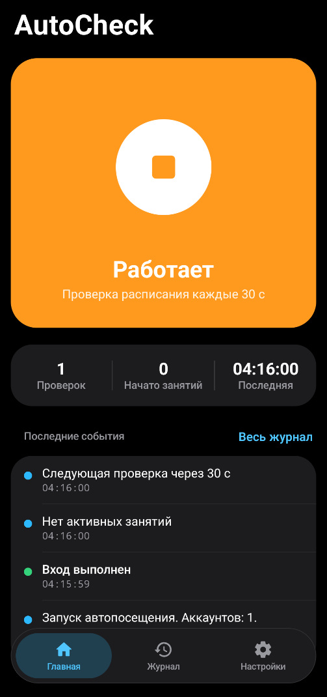

<h1 align="center">AutoCheck</h1>

  Android-приложение, которое автоматически отмечает посещение занятий 
  в личном кабинете <a href="https://lk.sut.ru">lk.sut.ru</a>

  
  
  
  
  

  

---

## О проекте

AutoCheck регулярно опрашивает расписание в личном кабинете и, как только у занятия появляется кнопка
**«Начать занятие»**, нажимает её от имени пользователя.

## Возможности

- **Несколько аккаунтов.** В каждом цикле приложение по очереди обходит все добавленные аккаунты; у каждого своя сессия,
  а ошибка одного аккаунта не мешает остальным. Список аккаунтов перечитывается каждый цикл, поэтому изменения
  подхватываются без перезапуска.
- **Вход по логину и паролю или по токену.** Для логина и пароля приложение само входит заново при истечении сессии.
  Токен — значение cookie `miden` из браузера: пароль не нужен, но истёкший токен придётся заменить.
- **Остановка при неверных данных.** Аккаунт с неверным паролем или истёкшим токеном больше не опрашивается, пока его не
  изменят; если так вышло со всеми аккаунтами, проверка останавливается и сообщает об ошибке.
- **Работа в фоне.** Проверка идёт в foreground-сервисе с wake lock, поэтому не прерывается при выключенном экране.
- **Настраиваемый интервал** проверки — от 5 до 300 секунд (по умолчанию 30 с).
- **Выбор сети.** Запросы можно направить как в системе, напрямую без VPN, только через Wi‑Fi или только через мобильную сеть.
- **Одно уведомление** с кнопкой «Остановить» / «Включить» — доступно и в свёрнутом виде. Состав событий в тексте уведомления настраивается.
- **Журнал событий** с уровнями (информация, успех, предупреждение, ошибка) и счётчиками на главном экране.
- **Безопасное хранение данных.** Аккаунты (логины, пароли, токены) лежат в `EncryptedSharedPreferences` (AES‑256), резервное копирование отключено,
  незащищённый HTTP-трафик запрещён.
- **Тема оформления:** как в системе, светлая или тёмная.

## Установка и сборка

**Требования:** Android Studio Ladybug (2024.2) или новее, JDK 17, устройство или эмулятор с Android 8.0+ (API 26).

1. Откройте папку проекта в Android Studio.
2. Дождитесь Gradle Sync — нужный Gradle 8.9 Studio скачает сама.
3. Запустите приложение кнопкой **Run ▶** либо соберите APK через **Build ▸ Build APK(s)**.

Debug-сборка появится в `build/app/outputs/apk/debug/app-debug.apk` — путь сборки перенаправлен в `build/` в корне проекта.

## Быстрый старт

1. Запустите приложение и разрешите показ уведомлений.
2. Откройте **Настройки ▸ Аккаунты** и добавьте один или несколько аккаунтов: «Логин и пароль» или «Токен»
   (значение cookie `miden` после входа в lk.sut.ru). Все настройки сохраняются автоматически.
3. При необходимости задайте интервал и маршрут трафика в разделе **Подключение**.
4. В разделе **Работа в фоне** отключите оптимизацию батареи для AutoCheck — так система не остановит проверку. Там же можно включить **автозапуск после перезагрузки**.
5. Нажмите круглую кнопку на главном экране. Состояние сменится на «Работает», а ход работы появится в журнале.

## Настройки

| Раздел | Что настраивается |
|---|---|
| Аккаунты | Любое число аккаунтов: логин и пароль либо токен (cookie `miden`) |
| Подключение | Маршрут трафика («Как в системе», «Напрямую, без VPN», «Только Wi‑Fi», «Только мобильная сеть») и интервал проверки |
| Уведомления | Какие события показывать: начатые занятия, ошибки, предупреждения, проверки, служебные; кнопка «Включить» после остановки |
| Оформление | Тема: как в системе / светлая / тёмная |
| Работа в фоне | Исключение из оптимизации батареи; автозапуск проверки после перезагрузки устройства (на Xiaomi, Huawei, Oppo, Vivo и др. есть кнопка перехода к системной настройке автозапуска) |

> **VPN.** Если VPN не пропускает приложение в выбранную сеть, в журнале появится ошибка `EPERM`. Добавьте AutoCheck
> в исключения VPN или выберите маршрут «Как в системе».

## Технологии

| Область | Решение |
|---|---|
| Язык и UI | Kotlin 2.0.21, Jetpack Compose (BOM 2024.10.01), Material 3 |
| Асинхронность | Kotlin Coroutines 1.9.0, `StateFlow` |
| Сеть | OkHttp 4.12.0 с привязкой сокетов к выбранной сети |
| Разбор HTML | Jsoup 1.18.1 |
| Хранение данных | AndroidX Security Crypto (`EncryptedSharedPreferences`) |
| Фоновая работа | Foreground service (`specialUse`), `PARTIAL_WAKE_LOCK` |
| Сборка | Gradle 8.9, Android Gradle Plugin 8.7.3, JDK 17 |

Разрешения: `INTERNET`, `ACCESS_NETWORK_STATE`, `FOREGROUND_SERVICE`, `FOREGROUND_SERVICE_SPECIAL_USE`,
`POST_NOTIFICATIONS`, `WAKE_LOCK`, `REQUEST_IGNORE_BATTERY_OPTIMIZATIONS`, `RECEIVE_BOOT_COMPLETED`.
